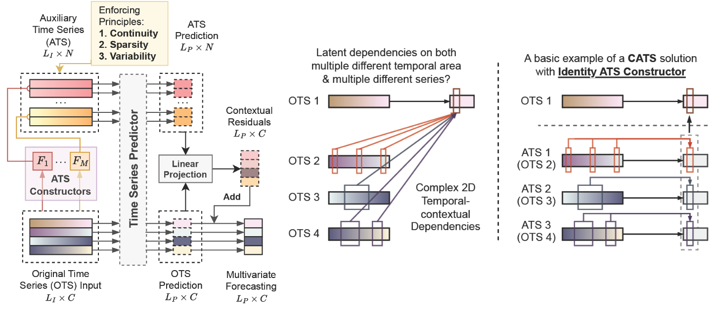

# CATS: Enhancing Multivariate Time Series Forecasting by Constructing Auxiliary Time Series as Exogenous Variables

This repository will host the code for our paper: ["CATS: Enhancing Multivariate Time Series Forecasting by Constructing Auxiliary Time Series as Exogenous Variables"](https://arxiv.org/abs/2403.01673), to be presented at ICML 2024.

## Code Release

At the current stage, we have released a tutorial in notebook format, `CATS-Tutorial.ipynb`, that demonstrates in detail how to build CATS with various predictors. We are in the process of developing a time series forecasting user interface that integrates statistical, machine learning, and deep learning methods. The complete pipeline usage of CATS will be available in this toolkit.

## Overall Architecture

