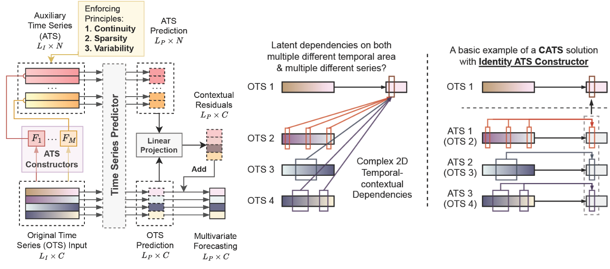

# CATS: Enhancing Multivariate Time Series Forecasting by Constructing Auxiliary Time Series as Exogenous Variables

This is the code repository for the paper:  
["CATS: Enhancing Multivariate Time Series Forecasting by Constructing Auxiliary Time Series as Exogenous Variables"](https://arxiv.org/abs/2403.01673).

We provide a tutorial notebook, `CATS-Tutorial.ipynb`, which demonstrates in detail how to build CATS with various predictors.

Please note that the full code and experimental environment have already been released in the repository:  
https://github.com/LJC-FVNR/ARMA-Attention.  
The CATS model implementation can be found in `models/CATS.py`.

You can run CATS as a baseline model using `./baseline.sh` by setting `model_name` to `CATS` in the shell script.

## Overall Architecture

